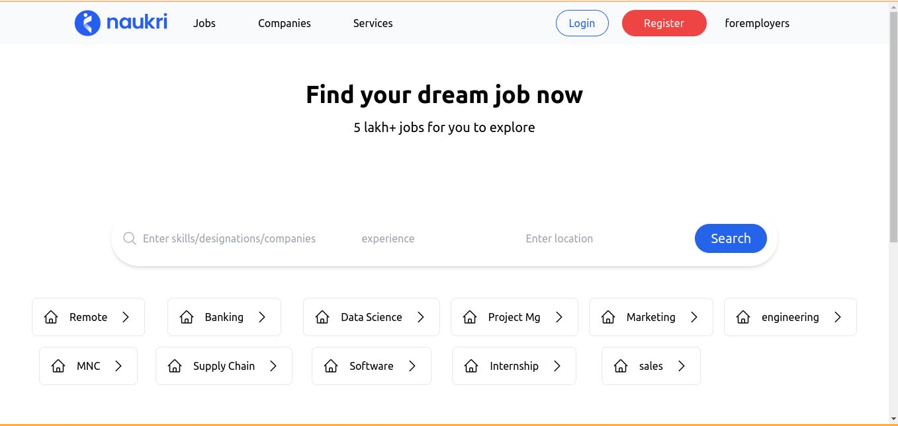

# 🖥️ Simple React UI – Naukri Clone (Just UI)

This is a **basic UI-only React project** built using [Create React App](https://github.com/facebook/create-react-app).  
There’s no backend or interactivity – just the design layout.

## 🔗 Live Preview

👉 [Open Live Site](https://moorthid2023.github.io/naukri)

## 🛠️ How to Run Locally

Clone the repository and run the following commands:

```bash
npm install
npm start

---

Let me know if you want to:
- Add screenshots of your UI in the README
- Add GitHub Actions to deploy automatically
- Include some badges (like React version, license, etc.)

Happy coding, Moorthi! 🚀
